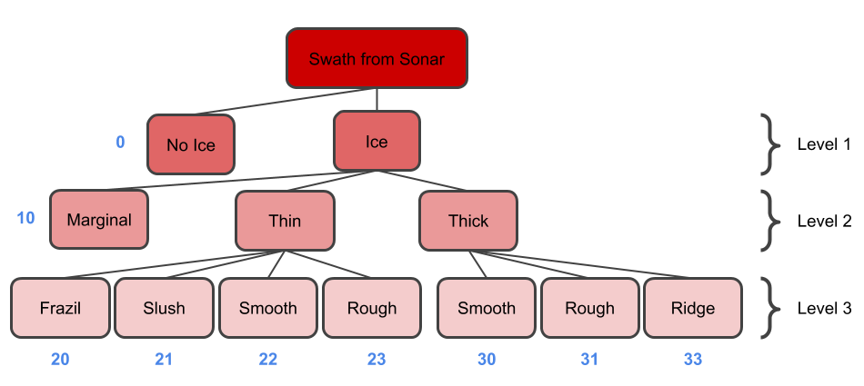

# Sonar Ice Detection
<!---------------------------------------------------------------------------->

## Table of Contents 
- [Micron Sonar Specifications](#micron-sonar-specifications)
- [Data Field Information](#data-field-information)
  - [Header Variables](#header-variables)
  - [Derived Variables](#derived-variables)  
  - [Ice Classification Variables](#ice-classification-variables)
  - [Intensity Variables](#intensity-variables)
- [Coordinate System Definition](#coordinate-system-definition)
- [Pseudocode for Parsing an Ensemble](#pseudocode-for-parsing-an-ensemble)
- [Notes](#notes)
- [List of TODOs](#list-of-todos)

<!-------------------------------------
Most Recent Changes:

Changes to Make before Commit:
-------------------------------------->

<!---------------------------------------------------------------------------->
## Micron Sonar Specifications 

Some of the Micron Sonar specification details are shown below. For all of the Micron Sonar specifications, please review the sonar specification sheet which can be found in this repository at: `./doc/Micron-Sonar-Spec-Sheet.pdf`.

| Parameter             | Value                 | Units |
| ---                   | ---:                  | ---   |
| Acoustic Frequency    | 700                   | kHz   |
| Vertical Beamwidth    | 35                    | deg   |
| Horizontal Beamwidth  | 3                     | deg   |
| Maximum Range         | 75                    | m     |
| Minimum Range         | 0.3                   | m     |
| Mechanical Resolution | {0.45, 0.9, 1.8, 3.6} | deg   |
| Best Range Resolution | ~7.5                  | mm    |
| Weight in Air         | 324                   | g     |
| Weight in Water       | 180                   | g     |
| Depth Rating          | 750                   | m     |
| Temperature Range     | [-10, 35]             | C     |

<!---------------------------------------------------------------------------->
## Data Field Information 
The data fields included in the MicronEnsemble class and the MicronTimeSeries class, and thus present in the processed CSV data files, can be broken down into four different categories: [Header Variables](#header-variables), [Derived Variables](#derived-variables), [Ice Classification Variables](#ice-classification-variables), and [Intensity Variables](#intensity-variables). Header Variables are variables that are included in the raw Miron Sonar data string. Derived Variables are variables that are given to the MicronEnsemble class during processing time (such as `sonar_depth` or `sonar_altitude`), deduced from Header Variables (such as `bin_size`), or deduced from Intensity Variables (such as `peak_width`). Ice Classification Variables are variables that describe ice-properties (such as `ice_category` or `ice_thickness`). Each classification variable has a *classification* version (such as `class_ice_category`) and *label* version (such as `label_ice_category`), where the *classification* version corresponds with the output from the automated classification system and the *label* version corresponds with the hand-annotated label for the ice type. Intensity Variables are the binned intensity values for the ensemble. All variables included in each variable category are described in the sub-sections below.  

<!------------------------------------>
### Header Variables 
Header Variables are variables that are included in the raw Miron Sonar data string. These variables are described in the table below. 

| Variable | Units | Description | 
| ---      | ---   | ---         |
|`line_header`  | | Line header, not important but included in the data array for completeness. |
|`date_time`    | | Float that represents date and time that the data was recorded. This number is produced with Python's datetime module using the function [`datetime.timestamp()`](https://docs.python.org/3/library/datetime.html#datetime.datetime.timestamp) function. This is similar to the Python `time.time()` function that converts the current time to a float. |
|`node`         | | Node, takes on the value of 2 for imaging sonars, not important but included in the data array for completeness. |
|`status`       | | Data validation byte in hexadecimal, states whether or not the ensemble is OK and can be used. Note, this field is not currently being parsed. |
|`hdctrl`       | | Two byte bit set, includes extra information about sonar settings such as scan direction or inverted mode etc. Note, this field is not currently being parsed. |
|`range_scale`  | [m] | Range setting for the sonar. |
|`gain`         | [0,255] | Receiver gain that was used when recording the ensemble. The the gain is reported in non-dimensional format in the range [0,255] where 0 corresponds with zero percent gain and 255 corresponds with 100 percent gain. |
|`slope`        | | Receiver slope or Time Variable Gain (TVG) that was applied at the receiver for the current scanline and helps to show control state during replay. |
|`ad_low`       | [dB] | Control the mapping of the received sonar echo amplitude  to the color displayed in Tritech visualization software. Reported in the dynamic range of the sonar, [0dB, 80dB]. |
|`ad_span`      | [dB] | Control the mapping of the received sonar echo amplitude  to the color displayed in Tritech visualization software. Reported in the dynamic range of the sonar, [0dB, 80dB]. |
|`left_lim`     | [deg] | The left limit of the sonar swath when the ensemble was received, reported in [modified polar coordinate system](#modified-polar-coordinate-system) |
|`right_lim`    | [deg] | The right limit of the sonar swath when the ensemble was received, reported in [modified polar coordinate system](#modified-polar-coordinate-system) |
|`steps`        | [deg] | The angular step size between successive ensemble measurements. This corresponds with [resolution setting](#note-on-bearing-step-size) of the sonar. |
|`bearing`      | [deg] | The bearing of the transducer head when the ensemble was received, reported in [modified polar coordinate system](#modified-polar-coordinate-system) |
|`dbytes`       | | The number of intensity bins reported in the ensemble. Note that there is a nonintuitive pattern between the sonar settings used and the number of intensity bins [included in the ensemble](note-on-ensemble-size) |

<!------------------------------------>
### Derived Variables 
Derived Variables are variables that are given to the MicronEnsemble class during processing time, deduced from Header Variables, or deduced from Intensity Variables. These variables are described in the table below. 

| Variable | Units | Description | 
| ---      | ---   | ---         |
| `year`               | | Year that the data was recorded. Note that this variable must be passed to the MicronEnsemble constructor because the sonar does not include the year in the raw `date_time` Header Variable. |
| `month`              | | Month that the data was recorded. Note that this variable must be passed to the MicronEnsemble constructor because the sonar does not include the month in the raw `date_time` Header Variable. |
| `day`                | | Day that the data was recorded. Note that this variable must be passed to the MicronEnsemble constructor because the sonar does not include the day in the raw `date_time` Header Variable. |
| `sonar_depth`        | [m] | Depth of the transducer head below the sea surface when the ensemble was taken. Note that this variable is passed to the MicronEnsemble constructor because the sonar does not measure depth. If given, surface reflections are filtered out of the intensity bins. |
| `sonar_altitude`     | [m] | Altitude of the transducer head above the seafloor when the ensemble was taken. Note that this variable is passed to the MicronEnsemble constructor because the sonar does not measure altitude. If given, bottom reflections are filtered out of the intensity bins. |
| `bearing_bias`       | [deg] | Bearing bias in the sonar orientation due to either misalignment in mounting, or due to a roll bias of the vehicle itself. Note that this variable is passed to the MicronEnsemble constructor. |
| `bearing_ref_world`  | [deg] | Bearing reference to the horizontal plane, in the [modified polar coordinate system](#modified-polar-coordinate-system). If the `bearing_bias` is zero, then this variable will be the same as the `bearing` Header Variable. Otherwise, this variable will account for sonar mounting bias or vehicle roll bias. |
| `incidence_angle`    | [deg] | Incidence angle from the transducer head direction with the horizontal plane. This is the absolute value of `bearing_ref_world`. |
| `bin_size`           | [m] | Slant range that each intensity bin spans. This is dependent on the `range_scale` setting prescribed and the number of `dbytes` received from the sonar.  |
| `max_intensity`      | [dB] | Maximum intensity reported in the ensemble. Reported in the dynamic range of the sonar, [0dB, 80dB]. |
| `max_intensity_bin`  | | Bin location where the `max_intensity` value was found. |
| `max_intensity_norm` | [dB * m | Normalized maximum intensity value, given by the `max_intensity` value in [dB] multiplied by the `peak_start` distance in [m]. This metric is computed to account for the 1/distance loss in acoustic intensity due to spreading and attenuation. |
| `peak_start_bin`     | | Bin location where the start of the signal peak occurs. Note that the [Full Width Half Maximum (FWHM) method](https://en.wikipedia.org/wiki/Full_width_at_half_maximum) is used to compute the signal peak. |
| `peak_start`         | [m] | Slant range distance to the start of the signal peak, derived by multiplying `peak_start_bin` by `bin_size`. |
| `peak_end_bin`       | | Bin location where the end of the signal peak occurs. Note that the [Full Width Half Maximum (FWHM) method](https://en.wikipedia.org/wiki/Full_width_at_half_maximum) is used to compute the signal peak.  |
| `peak_end`           | [m] | Slant range distance to the end of the signal peak, derived by multiplying `peak_end_bin` by `bin_size`. |
| `peak_width_bin`     | | Width of the signal peak in terms of number of intensity bins, derived by subtracting `peak_start_bin` from `peak_end_bin`. |
| `peak_width`         | [m] | Slant range width of signal peak derived by multiplying `peak_width_bin` by `bin_size`. |
| `vertical_range`     | [m] | Vertical range from the transducer head to the contact point of the acoustic signal. Derived by multiplying the `peak_start` variable by the cosine of `bearing_ref_world`. |

<!------------------------------------>
### Ice Classification Variables 
Ice Classification Variables are variables that describe ice-properties. Each classification variable has a *classification* version and *label* version, where the *classification* version corresponds with the output from the automated classification system and the *label* version corresponds with the hand-annotated label for the ensemble. These variables are described in the table below. 

| Variable | Units | Description | 
| ---      | ---   | ---         |
| `class_ice_category`   | | Automated classification result for ice-category. See the [section about ice categories](#note-on-ice-categories) for more information. |
| `class_ice_presence`   | [0,1] | Automated classification result for ice-presence for the given swath of ensembles. Instead of being a boolean flag like `label_ice_presence`, this variable encodes a confidence from the classification system: a value of 1 means high confidence at that ice is present, a value of 0 means high confidence that ice is not present, and a value of 0.5 means uncertain whether or not ice is present. 
| `class_ice_percent`    | [%] | Automated classification result for ice-percentage for the given swath of ensembles. |
| `class_ice_thickness`  | [m] | Automated classification result for ice-thickness for the given swath of ensembles.  |
| `class_ice_slope`      | | Automated classification result for ice-slope for the given swath of ensembles. |
| `class_ice_roughness`  | [TBD] | Automated classification result for ice-roughness. Units for ice roughness are currently TBD because it has not been determined how well ice roughness can be devised from the sonar.|
| `label_ice_category`   | | Hand-annotated label for ice-category. See the [section about ice categories](#note-on-ice-categories) for more information.|
| `label_ice_presence`   | {0,1} | Hand-annotated label for ice-presence, where ice-presences is a boolean flag regarding whether or not ice is present. A value of 1 means that ice is present and a value of 0 means that ice is not present. |
| `label_ice_percent`    | [%] | Hand-annotated label for ice-percentage for the given swath of ensembles.|
| `label_ice_thickness`  | [m] | Hand-annotated label for ice-thickness for the given swath of ensembles.  |
| `label_ice_slope`      | | Hand-annotated label for ice-slope for the given swath of ensembles. |
| `label_ice_roughness`  | [TBD] | Hand-annotated label for ice-roughness for the given swath of ensembles. Units for ice roughness are currently TBD because it has not been determined how well ice roughness can be devised from the sonar. |
| `label_saltwater_flag` | {0,1} | value 1 means saltwater, 0 freshwater |

<!------------------------------------>
### Intensity Variables 
Intensity Variables are the binned intensity values for the ensemble. These variables are described in the table below. 

| Variable  | Units | Description | 
| ---       | ---   | ---         |
| `bin_0`   | [dB]  | Intensity received from the first bin, reported in the dynamic range of the sonar, [0dB, 80dB]. Use the `bin_size` Derived Variable to determine the slant-range distance that each intensity bin corresponds with. |
| ... | ... | ... |
| `bin_499` | [dB]  | Intensity received from the last bin, reported in the dynamic range of the sonar, [0dB, 80dB]. Use the `bin_size` Derived Variable to determine the slant-range distance that each intensity bin corresponds with. | 

<!---------------------------------------------------------------------------->
## Coordinate System Definition
The polar coordinate system that defines bearing reference to the transducer head position has been updated from the original Micron Sonar polar coordinate system for ease of interpretation. In the modified coordinate system, zero degrees points straight upwards towards the ice or sea-surface, and positive degree values [0,180] correspond with the starboard side of the vehicle and negative degree values [0,-180] correspond with the port side of the vehicle. The modified and original polar coordinate systems are described more below. 

<!------------------------------------>
### Modified Polar Coordinate System

| Angle [deg] | Direction   | 
| ---: | ---         | 
| 0    |  upwards    |
| 90   |  starboard  |
| 180  |  downwards  |
| -180 |  downwards  |
| -90  |  port       |

<!------------------------------------>
### Original Polar Coordinate System

| Angle [deg] | Direction   | 
| ---:| ---         | 
| 0   |  upwards    |
| 90  |  port       |
| 180 |  downwards  |
| 270 |  starboard  |

<!---------------------------------------------------------------------------->
## Pseudocode for Parsing an Ensemble
1. Parse Header Variables
    1. Convert Header Variables to standard metric quantities when applicable.
    1. Perform coordinate transformation for bearing variables
    1. Parse `status` and `hdctrl` bit encodings (Not implemented yet)
    1. Compute the `bin_size` variable so that the intensity values are parsed correctly. This is the only Derived Variable computed alongside the Header Variables.
1. Parse Intensity Variables
    1. Convert Intensity Variables to standard metric quantities.
    1. Filter out Intensity Variables within the blanking distance of the sonar.
    1. Filter out Intensity Variables that are due to surface or bottom reflections. 
1. Parse Derived Variables 
    1. Compute maximum intensity information, including normalized maximum intensity that multiplies the distance of maximum intensity bin by the distance between the transducer head and the maximum intensity bin. This normalized maximum intensity is computed to account for the decay of acoustic intensity with the inverse distance through the water column.
    1. Determine the peak of the signal by using the [Full Width Half Maximum (FWHM) method](https://en.wikipedia.org/wiki/Full_width_at_half_maximum).

<!---------------------------------------------------------------------------->
## Notes

<!------------------------------------>
### Note on Bearing Step Size
There is a discrepancy between the value given in the Micron Sonar data-field for the step-size of the ensemble and the actual difference in bearing between successive measurements. As shown in the table below, for all resolution settings, the actual difference in bearing between successive measurements is  twice the value of what is reported by the Micron Sonar, according to Tritech Documentation regarding the units of the reported `steps` variable. I believe that this is due to a small error in the Tritech documentation or a (relatively) harmless bug in the Micron Sonar logging software. The discrepancy has been accounted for in the `MicronEnsemble` class, so the `steps` variable is consistent with the difference in bearing between successive measurements. 

| Resolution Setting  | Degree Step Size (Tritech Docs) | Degree Step Size (Actual) | 
| ---:   |  :--- | :--- |
|ultra   | 0.45  | **0.9**  |
|high    | 0.9   | **1.8**  |
|medium  | 1.8   | **3.6**  |
|low     | 3.6   | **7.2**  |

<!------------------------------------>
### Note on Ensemble Size 
Upon inspection of the Micron Sonar data, the number of intensity bins included in the ensemble is dependent on multiple settings, including the range setting and the resolution setting. The rule that dictates the number of intensity bins in a given file is not obvious. Unfortunately, the Micron Sonar user manual and Seanet DumpLog software manual do not touch on this subtlety.

To showcase the variance in the number of intensity bins, we kept all sonar settings constant while varying the range setting and we recorded the number of intensity bins that were included in the file. Note that the maximum range of the Micron Sonar is 75m, so any range setting at 80m or above does not obey the specification of the instrument. Interestingly, the largest number of intensity bins, 469, occurred for the 8m range case. No obvious pattern emerges that describes the number of intensity bins as a function of sensor range. 

| Range [m]   | # Intensity Bins|
| ---:        | ---             | 
| 2           | 434             |
| 6           | 465             |
| 8           | 469             |
| 10          | 461             |
| 20          | 460             |
| 30          | 461             |
| 50          | 461             |
| 80          | 461             |
| 100         | 455             |
| 120         | 450             |
| 150         | 462             |
| 180         | 458             |
| 200         | 455             |
| 250         | 435             |
| 300         | 442             |
| 350         | 421             |
| 400         | 428             |
| 800         | 422             |

<!------------------------------------>
### Note on Ice Categories
A hierarchical classification scheme is used to devise different ice categories that can be differentiated by the automated classification scheme. The first hierarchy of classification is to determine whether ice is present or not. The second hierarchy of classification is to determine if the ice is marginal, thick, or thin. The third hierarchy of classification is to assess the texture of the ice: whether the ice is smooth, rough, frazil or slush, or pressure ridge. These categories are shown in the tree structure below, where the blue numbers next to the ice-categories are the corresponding numerical value of said category. Note that the category numbers are ordered such that bigger numbers indicate greater presence. As such, category 0 is no ice, category 10 is marginal ice, category numbers in the 20's are thin ice, and category numbers in the 30's are thick ice.

  

<!------------------------------------>
### Miscellaneous Notes
- The "Micron Sonar User Manual" and the "Seanet DumpLog Software Manual" documents where used extensively when creating this software. These references can be viewed in the `doc/` directory.
- The Micron Sonar receiver has an 80dB dynamic range and signal levels are processed internally such that one byte per intensity value yields a range: [0,255], which in turn maps to the dynamic range of the sonar: [0,80dB].
- The Micron Sonar classes in this repository and the Pathfinder classes in the `dvl-nav` repository have been designed to have a relatively similar structure and readability. However, as a result of many subtle differences between the two sensors, there is not a plan to connect the two sets of classes via a parent super-class. 
- As changes are made to MicronSonar class, more column variables may be added or removed. As a result, future versions of the code may not be compatible with previous versions because the columns are no longer the same (or there is a different number of columns). To account for this, the user can either re-parse the raw CSV files and save the output with the new format, or the old files can be opened and adjusted to match the format of the new time series format.

<!---------------------------------------------------------------------------->
## List of TODOs

<!------------------------------------>
### MicronSonar TODOs
- check if [error in step size](#note-on-bearing-step-size) is a result of faulty documentation or faulty Seanet Pro software (I suspect this is a result of Seanet Pro software). Make sure that low-level polling software can handle the prescribed scanning resolutions mentioned in the spec sheet.

<!------------------------------------>
### MicronEnsemble TODOs
- add class method constructor to create ensemble from row of TimeSeries 
- dont use `ice-per` classification? -- may not make sense for small scanning window that the scanning sonar is able to view. instead, ice percentage can be computed in a post-processing effort with geo-referenced swaths over a larger area of survey  
- how to normalize with respect to gain and distance from transducer? (already have distance factored into the normalized max intensity)
- convert `status` and `Hdctrl` to binary and process for status (reject values that are not OK). see some initial code for doing this in the Python notebook. 
    - investigate why status value is 144? (if 144 is int -> 8 bits, if 144 is hex -> requires 9 bits) (contact Tritech about this?)
- what dictates the number of dbytes included in an ensemble? -- not obvious upon inspecting the data-files, but perhaps it will be easier to discern when using a low-level polling method. (contact Tritech about this?)
- why does the steps variable not match the difference between successive bearing measurements? (contact Tritech about this?)
 
<!------------------------------------>
### MicronTimeSeries TODOs
- when `ts.set_label_by_bearing()` is called, *sometimes* a `SettingFromCopy` warning is displayed. I believe this is a result of setting a value to a DataFrame via the `iloc` method. This seems to be a common issue discussed on Stack Overflow and other websites. The confusing part to me is that the warning seems to be displayed in a non-deterministic patter (i.e. it is not always displayed and there is not a clear patter that leads to this warning)
- compute `ice_roughness` and `ice_slope` calculations 
- collect groups of ensembles into "swaths" which are used for classification. Note that the classification function should operate in a wide variety of polling strategies. Perhaps the TimeSeries object can keep track of a running list of "most recent" swath collected (with time bounds potentially?) that keep track of most recently seen bearing_ref_world values. Then a function that classifies ice-types will run on the most recent swath.

<!------------------------------------>
### micron_plotter TODOs
- add ability to make a three-view plot, provided three vectors 
- add radial distance markings to the polar plot 

<!------------------------------------>
### README TODOs
- clarify the difference between thick, thin, and marginal ice 
- clarify the difference between smooth and rough ice
